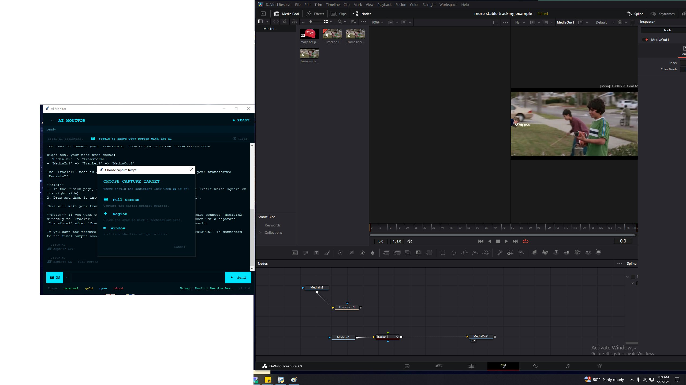
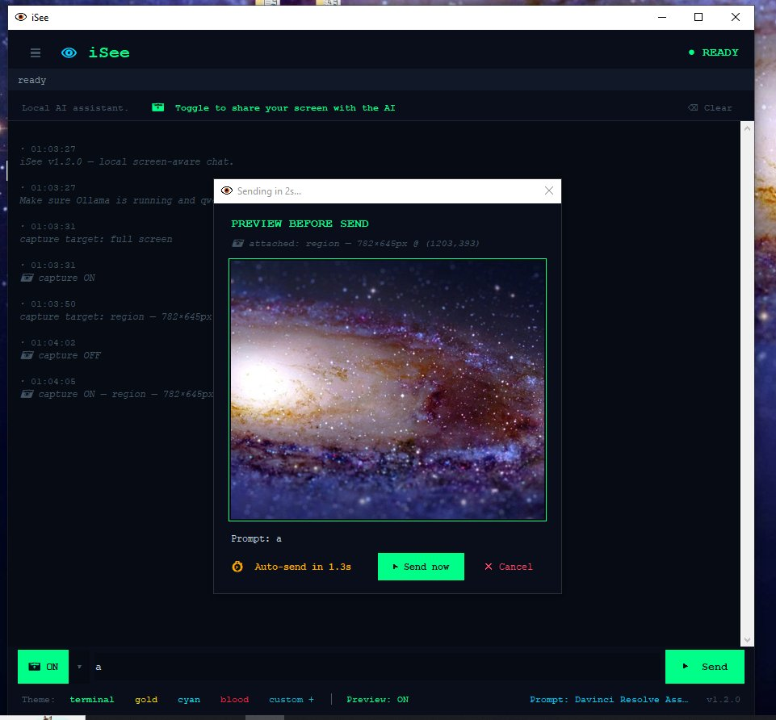

# iSee

**A local screen-aware chat assistant.** Runs Qwen 3.5:9b on your own
machine via Ollama. Toggle one button and the AI can see whatever's
on your screen — a window, a region, an entire monitor — and answer
questions about it conversationally.

No API keys required. No cloud. Screenshots and chat stay on your
computer.


## What this is for

Most "AI sees your screen" tools are either locked to a browser
(Operator, Browser Use), locked to an OS ecosystem (Apple
Intelligence, Copilot Recall), or live behind a cloud subscription.
iSee fills the gap nobody else quite does: a chat assistant that
works on **anything visible on your desktop** — a video editor, a
trading platform, a video game, an obscure piece of software, a chart
someone pasted into a Slack message — and runs entirely on your
machine.

The headline use case: you're stuck in some software, you screenshot
the relevant window, and you ask a question. The assistant looks at
the actual UI, not a description of it, and tells you what to click.

Worth knowing: most cloud assistants (ChatGPT, Claude, Gemini) heavily
throttle image uploads on their free tiers, and the paid entry tiers
gatekeep vision behind a subscription. Because iSee runs Qwen
locally, **screenshots are effectively free and unlimited.** You can
ask about your screen 200 times a day without burning through a
quota or paying for a tier upgrade. That alone changes how you use
the tool — there's no friction tax on "let me just check this real
quick."

## Prompt knowledge matters — a lot

Out of the box, iSee is a general assistant with a screen view. The
real upgrade is loading a **domain prompt** that turns the same model
into a domain expert. The difference is large enough that it changes
what the product is.

The example below is a real exchange. The user asked iSee to help
fix a Fusion node graph in DaVinci Resolve. With a DaVinci-specific
prompt loaded (included in `prompts/`), Qwen diagnosed the issue —
the node tree was missing a Tracker node entirely — and walked the
user through adding one and wiring it correctly, referencing actual
node names, input colors, and ports:


That kind of response normally only comes from someone who actually
knows DaVinci. It came from a 9B local model because the prompt gave
it the role.

A starter DaVinci Resolve prompt ships with iSee. See `prompts/`.

## Features

- **📷 Screen capture toggle** — full screen, click-and-drag region,
  or pick from open windows
- **Custom prompts** — save reusable expert prompts, switch with one
  click, persist across sessions
- **Conversation history** — ChatGPT-style left sidebar, all past
  conversations saved as JSON, auto-titled from the first message
- **Snapshot Preview** — optional 5-second preview-before-send modal
  so you can confirm what's being captured (off by default)
- **Drag-and-drop image support** — drop any PNG/JPG onto the chat to
  ask about it (separate from screen capture)
- **Four built-in themes** plus a custom color picker that
  auto-derives a full palette from any accent color you choose
- **No cloud, no API keys** — all chat and screenshots stay local

## Screenshots

Choose what to capture — full screen, drag-to-pick region, or any
open window:



Manage and switch between custom domain prompts:


Optional 5-second preview modal before send (toggle in footer):



## Install

**Requirements:**

1. Python 3.10+
2. [Ollama](https://ollama.com) running locally with the
   `qwen3.5:9b` model pulled:
   ```bash
   ollama pull qwen3.5:9b
   ```
3. Python dependencies:
   ```bash
   pip install -r requirements.txt
   ```

**Run:**

```bash
python ai_monitor.py
```

The app will create `app_settings.json` and a `conversations/` folder
on first launch.

## Optional dependencies

- **`tkinterdnd2`** — enables dragging image files onto the chat from
  File Explorer / Finder. iSee runs fine without it; drag-drop is
  just disabled.
- **`pygetwindow`** — required for the "pick a window" capture mode.
  Region and full-screen capture work without it.

## Hardware notes

iSee was developed and tested on a **GTX 1080 (8GB VRAM)** with 32GB
system RAM — a rig that's now several generations old. On that
hardware:

- First Qwen call after launch: 60–90 seconds (Ollama warm-up)
- Subsequent text-only replies: 5–15 seconds
- Replies with a screenshot attached: 15–40 seconds

Newer hardware will be meaningfully faster. A 30-series or 40-series
NVIDIA card cuts response times by 2–3x in casual testing. If you're
running on something modern, expect snappier replies than the
numbers above.

Comfortable baseline:
- 16GB system RAM (32GB if you also run Ollama alongside other heavy
  apps)
- NVIDIA GPU with at least 8GB VRAM
- Modern CPU isn't critical — inference is GPU-bound

CPU-only inference works but is much slower (often minutes per
reply). If you don't have a GPU, switch `QWEN_MODEL` to something
smaller like `qwen3.5:3b` in the script — it's still useful for
conversational chat and basic screen reading.

## Qwen tuning

Getting decent responses out of a 9B local model took a fair bit of
trial-and-error. The current settings are baked into `ai_monitor.py`
near the top, but they're worth knowing about if you want to
experiment:

- **`/api/chat`, not `/api/generate`** — Ollama issue #14793 silently
  ignores `think: false` on `/api/generate` for `qwen3.5:9b`, so the
  model spends its output budget on hidden reasoning tokens and
  returns sparse answers. `/api/chat` honors the flag correctly.
- **`think: false` at the top level of the payload** — not nested
  inside `options`. This was the single biggest improvement.
- **Sampling:** `temperature=0.7, top_p=0.8, top_k=20,
  presence_penalty=1.5`. Presence penalty in particular cuts down
  on the "let me explain again..." repetition that small models
  fall into.
- **Context window:** 8192 tokens normally, 16384 when an image is
  attached. Bigger context with vision keeps the screenshot from
  squeezing out conversation history.
- **Response post-processing:** strips `<think>...</think>` blocks
  and bare ``` fences from output. Qwen sometimes leaks these even
  when thinking is supposedly off.

If your responses feel sluggish or repetitive, those constants are
the first things to tweak. They live as named constants at the top
of `ai_monitor.py` — search for `QWEN_SAMPLING`.

## Why Qwen 3.5:9b?

iSee defaults to Qwen 3.5:9b for a few practical reasons, not
because it's "the best vision model" — that title shifts every few
months. Specifically:

- **Genuinely capable at vision.** Qwen 3.5 is one of the stronger
  open-weight vision-language models available right now. It can
  read UI elements, follow node graphs, parse charts, identify
  buttons, and reason about layout — all the things a screen-aware
  assistant actually needs. Not frontier-tier, but a real step up
  from older open vision models.
- **Hits a useful size threshold.** The 9B variant fits in 8GB of
  VRAM with room to spare, which means it runs on hardware most
  people already have (anything from a GTX 1080 onward). Smaller
  variants exist but visibly drop in vision quality; bigger ones
  need 16GB+ VRAM that's less common.
- **Trivial to run via Ollama.** One `ollama pull` command and
  you're done. No model conversion, no container fiddling, no
  CUDA-toolkit gymnastics.
- **Apache 2.0 licensed.** You can use it commercially, fork it,
  modify it. No surprise license restrictions.

Translation: Qwen 3.5:9b is "good enough vision quality on hardware
people own, with no friction to set up." It's not a religious
choice — see the next section for swapping it out.

## Swapping models

The default is `qwen3.5:9b` because it hits a good size/quality
balance for the 8GB-VRAM target and has solid vision support. But
the architecture is model-agnostic — anything Ollama supports with
vision will work, and you should feel free to experiment.

To swap models, edit `QWEN_MODEL` near the top of `ai_monitor.py`:

```python
QWEN_MODEL = "qwen3.5:9b"      # default
# QWEN_MODEL = "qwen3.5:14b"   # bigger, slower, better
# QWEN_MODEL = "qwen3.5:32b"   # much bigger, needs ~24GB VRAM
# QWEN_MODEL = "qwen3.6:9b"    # newer Qwen if it's out
# QWEN_MODEL = "llama3.2-vision:11b"  # Meta's vision model
```

Then `ollama pull <model>` to download the weights, and restart
iSee. Larger models are obviously better but slower; on a 1080 the
9B is the sweet spot. On a 4090 or better, the 32B variant becomes
genuinely usable and the responses feel closer to frontier.

If you find a model that works noticeably better, please open an
issue or PR — the default is just the best of what was tested,
not the only option.

## File layout

```
iSee/
├── ai_monitor.py          # main app (single file)
├── requirements.txt
├── LICENSE                # MIT
├── README.md
├── prompts/               # starter prompt pack
│   ├── README.md          # how to use prompts
│   └── davinci_resolve_assistant.txt
├── docs/                  # screenshots used in this README
└── (runtime, gitignored:)
    ├── app_settings.json  # theme, custom prompts, preferences
    ├── qwen_debug.log     # Qwen response log for debugging
    └── conversations/     # one JSON per saved conversation
```

## Privacy

- **Screenshots** are sent only to your local Ollama instance. They
  are not retained in conversation history beyond the current turn.
- **Saved conversations** on disk contain only the text exchange and
  small "📷 attached: ..." markers — never the actual image data.
- **No telemetry, no API keys, no cloud.** The app makes one network
  call: to `localhost:11434` (Ollama).
- **No usage limits.** Cloud assistants meter image uploads on free
  tiers and gate vision behind paid tiers. iSee uses your own GPU,
  so screenshots are unmetered. Ask 200 questions a day if you want.

## Known limitations

- **Single image per turn.** You can attach a screenshot OR a
  drag-dropped image, not both at once.
- **Vision quality is bounded by Qwen 3.5:9b.** It's good but not
  frontier-tier. Smaller regions zoomed in beat full-screen
  screenshots for tricky details.
- **No multi-monitor smarts.** Full-screen capture grabs the primary
  monitor only. Region select works across whichever monitor your
  cursor is on when you launch the picker.
- **Windows/macOS/Linux compatibility:** developed and tested on
  Windows. Should run on macOS and Linux but some behaviors (window
  picker, icon rendering) may differ slightly.

## Contributing

Domain prompts that work well are the most valuable contribution.
Drop your `.txt` prompt into `prompts/` and open a PR — it makes the
app immediately more useful for the next person.

Code contributions and bug reports also welcome. The whole app is one
file (~3200 lines, heavily commented) so the bar to making changes is
low.

## License

MIT. See [LICENSE](LICENSE).
