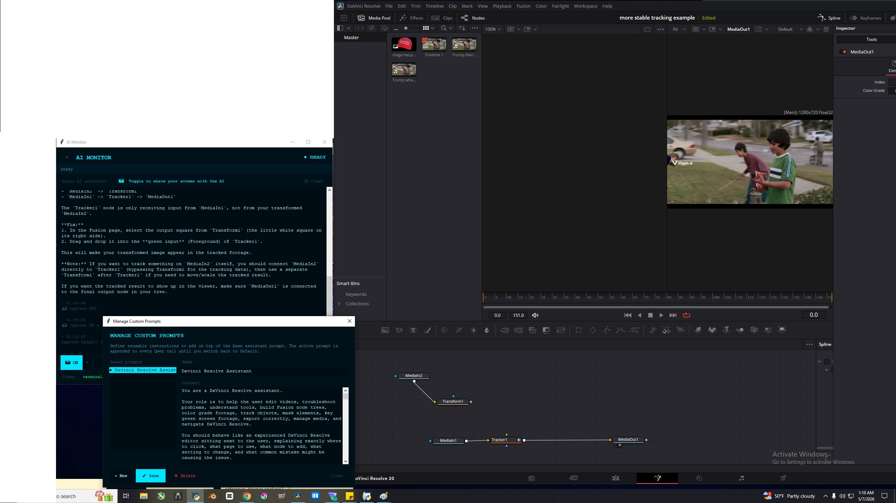

# iSee

**A local screen-aware chat assistant.** Runs Qwen 3.5:9b on your own
machine via Ollama. Toggle one button and the AI can see whatever's
on your screen — a window, a region, an entire monitor — and answer
questions about it conversationally.

No API keys required. No cloud. Screenshots and chat stay on your
computer.


## What this is for

Most "AI sees your screen" tools are either locked to a browser
(Operator, Browser Use), locked to an OS ecosystem (Apple
Intelligence, Copilot Recall), or live behind a cloud subscription.
iSee fills the gap nobody else quite does: a chat assistant that
works on **anything visible on your desktop** — a video editor, a
trading platform, a video game, an obscure piece of software, a chart
someone pasted into a Slack message — and runs entirely on your
machine.

The headline use case: you're stuck in some software, you screenshot
the relevant window, and you ask a question. The assistant looks at
the actual UI, not a description of it, and tells you what to click.

## Prompt knowledge matters — a lot

Out of the box, iSee is a general assistant with a screen view. The
real upgrade is loading a **domain prompt** that turns the same model
into a domain expert. The difference is large enough that it changes
what the product is.

The example below is a real exchange. The user asked iSee to help fix
a Fusion node graph in DaVinci Resolve. With a DaVinci-specific
prompt loaded (included in `prompts/`), Qwen diagnosed the issue —
the Tracker node was reading from the wrong input — and walked the
user through a concrete fix referencing actual node names, ports, and
colors:


That kind of response normally only comes from someone who actually
knows DaVinci. It came from a 9B local model because the prompt gave
it the role.

A starter DaVinci Resolve prompt ships with iSee. See `prompts/`.

## Features

- **📷 Screen capture toggle** — full screen, click-and-drag region,
  or pick from open windows
- **Custom prompts** — save reusable expert prompts, switch with one
  click, persist across sessions
- **Conversation history** — ChatGPT-style left sidebar, all past
  conversations saved as JSON, auto-titled from the first message
- **Snapshot Preview** — optional 5-second preview-before-send modal
  so you can confirm what's being captured (off by default)
- **Drag-and-drop image support** — drop any PNG/JPG onto the chat to
  ask about it (separate from screen capture)
- **Four built-in themes** plus a custom color picker that
  auto-derives a full palette from any accent color you choose
- **No cloud, no API keys** — all chat and screenshots stay local

## Screenshots

Choose what to capture — full screen, drag-to-pick region, or any
open window:


Manage and switch between custom domain prompts:



Optional 5-second preview modal before send (toggle in footer):


## Install

**Requirements:**

1. Python 3.10+
2. [Ollama](https://ollama.com) running locally with the
   `qwen3.5:9b` model pulled:
   ```bash
   ollama pull qwen3.5:9b
   ```
3. Python dependencies:
   ```bash
   pip install -r requirements.txt
   ```

**Run:**

```bash
python ai_monitor.py
```

The app will create `app_settings.json` and a `conversations/` folder
on first launch.

## Optional dependencies

- **`tkinterdnd2`** — enables dragging image files onto the chat from
  File Explorer / Finder. iSee runs fine without it; drag-drop is
  just disabled.
- **`pygetwindow`** — required for the "pick a window" capture mode.
  Region and full-screen capture work without it.

## Hardware notes

Qwen 3.5:9b runs comfortably on a machine with:
- 16GB RAM
- An NVIDIA GPU with at least 8GB VRAM (better with more)
- Modern CPU

First call typically takes 60–90 seconds while Ollama warms up. After
that, replies arrive in 5–20 seconds depending on length and whether
a screenshot is attached.

If you don't have a GPU, the app will still run but inference will be
much slower — possibly minutes per response. Consider a smaller model
in that case (you can change `QWEN_MODEL` near the top of the script).

## File layout

```
iSee/
├── ai_monitor.py          # main app (single file)
├── requirements.txt
├── LICENSE                # MIT
├── README.md
├── prompts/               # starter prompt pack
│   ├── README.md          # how to use prompts
│   └── davinci_resolve_assistant.txt
├── docs/                  # screenshots used in this README
└── (runtime, gitignored:)
    ├── app_settings.json  # theme, custom prompts, preferences
    ├── qwen_debug.log     # Qwen response log for debugging
    └── conversations/     # one JSON per saved conversation
```

## Privacy

- **Screenshots** are sent only to your local Ollama instance. They
  are not retained in conversation history beyond the current turn.
- **Saved conversations** on disk contain only the text exchange and
  small "📷 attached: ..." markers — never the actual image data.
- **No telemetry, no API keys, no cloud.** The app makes one network
  call: to `localhost:11434` (Ollama).

## Known limitations

- **Single image per turn.** You can attach a screenshot OR a
  drag-dropped image, not both at once.
- **Vision quality is bounded by Qwen 3.5:9b.** It's good but not
  frontier-tier. Smaller regions zoomed in beat full-screen
  screenshots for tricky details.
- **No multi-monitor smarts.** Full-screen capture grabs the primary
  monitor only. Region select works across whichever monitor your
  cursor is on when you launch the picker.
- **Windows/macOS/Linux compatibility:** developed and tested on
  Windows. Should run on macOS and Linux but some behaviors (window
  picker, icon rendering) may differ slightly.

## Contributing

Domain prompts that work well are the most valuable contribution.
Drop your `.txt` prompt into `prompts/` and open a PR — it makes the
app immediately more useful for the next person.

Code contributions and bug reports also welcome. The whole app is one
file (~3200 lines, heavily commented) so the bar to making changes is
low.

## License

MIT. See [LICENSE](LICENSE).
